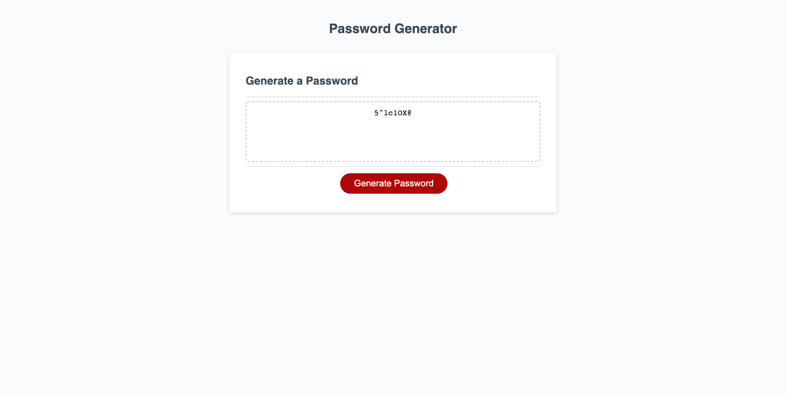

# 03 JavaScript: Password Generator

## My Task

This week’s homework required me to modify starter code to create an application that enables employees to generate random passwords based on criteria that they’ve selected. This app runs in the browser and features dynamically updated HTML and CSS powered by JavaScript code that I wrote. It has a clean and polished, responsive user interface that adapts to multiple screen sizes.

The password includes special characters. 

## User Story

```
AS AN employee with access to sensitive data
I WANT to randomly generate a password that meets certain criteria
SO THAT I can create a strong password that provides greater security
```

## Acceptance Criteria

```
GIVEN I need a new, secure password
WHEN I click the button to generate a password 
THEN I am presented with a series of prompts for password criteria
WHEN prompted for password criteria
THEN I select which criteria to include in the password
WHEN prompted for the length of the password
THEN I choose a length of at least 8 characters and no more than 128 characters
WHEN prompted for character types to include in the password
THEN I choose lowercase, uppercase, numeric, and/or special characters
WHEN I answer each prompt
THEN my input should be validated and at least one character type should be selected
WHEN all prompts are answered
THEN a password is generated that matches the selected criteria
WHEN the password is generated
THEN the password is either displayed in an alert or written to the page
```

## Result

I created a random password generator that creates a password from 8 to 125 characters that contains random numbers, letters and special characters such as $#@!. If the user enters anything less or more than the specified number of characters, then an alert will throw telling them to meet password length. If the user does not choose any of the password options such as upper case, lower case, numbers, or special characters, then an alert will be thrown saying they must choose at least option for the password. 

Below is what the password generator looks like. 
